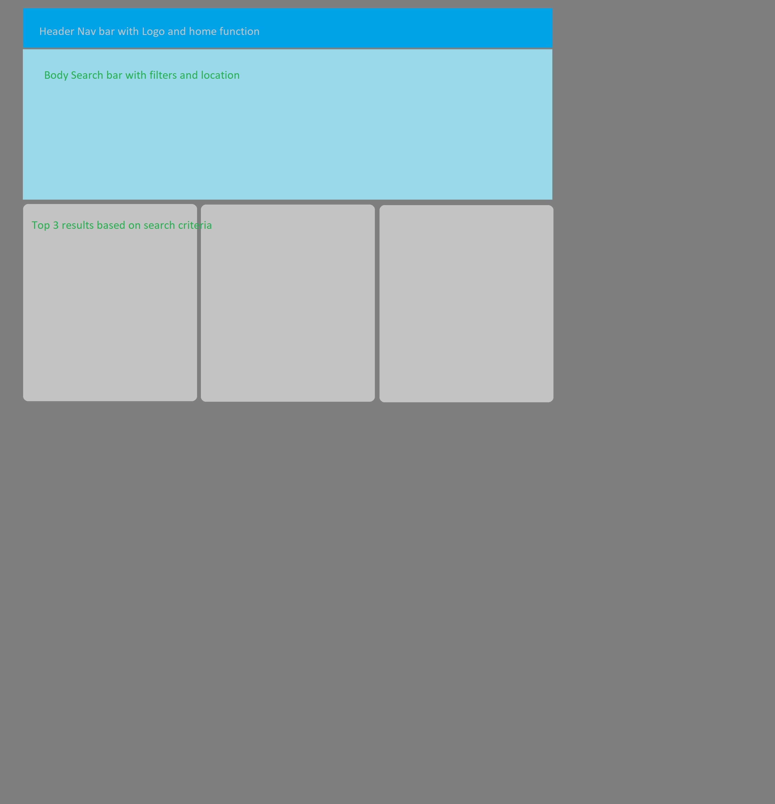

1. Project Title - Job Availability App

2. Application will collate available jobs/careers by sector, title, and location

3. User story
    3.1 Who - App is for job seekers
    3.2 What - Job information pulled from Wikipedia and a selection of jobs related to search.
    3.3 Goal - find a job

4. App wireframe
## Screenshots

5.  APIs to be used:

    5.1 Wikipedia API 
        From this link('https://www.mediawiki.org/wiki/API:Main_page'), 
        we found the following API:
        https://en.wikipedia.org/w/api.php

    5.2 Jooble, API key: Your API key is: "efebc8f0-344d-47a3-8970-4510f311c807".
        Code provided by Jooble from https://jooble.org/api/about
        <!-- <var url = "https://jooble.org/api/";
    <!-- var key = "<YOUR_API_KEY>";
        var params = "{ keywords: 'it', location: 'Bern'}"
     
        //create xmlHttpRequest object
        var http = new XMLHttpRequest();
        //open connection. true - asynchronous, false - synchronous
        http.open("POST", url + key, true);

        //Send the proper header information
        http.setRequestHeader("Content-type", "application/json");
        
        //Callback when the state changes
        http.onreadystatechange = function() {
        if(http.readyState == 4 && http.status == 200) {
            alert(http.responseText);
        } --> -->
<!-- }
        //Send request to the server
        http.send(params);> --> -->

6. Tasks
    6.1 Landing Page
    6.2 Search Function
    6.3 Fetch
    6.4 Local Storage
    6.5 Display Results

